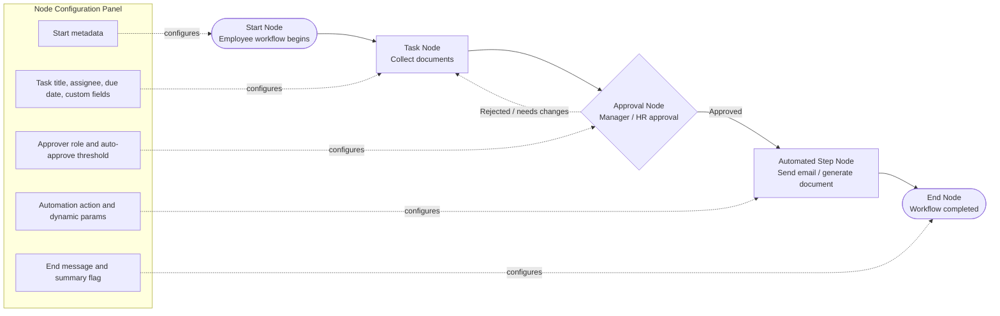
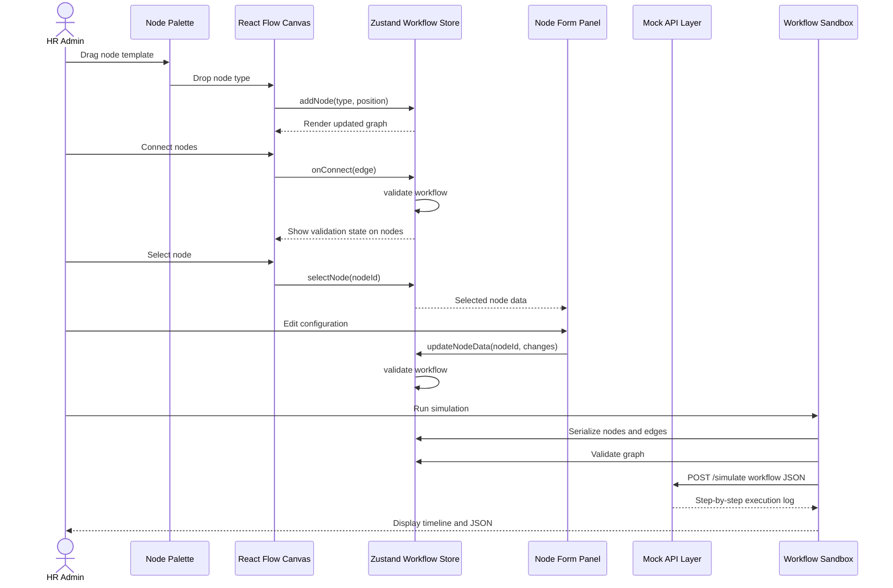
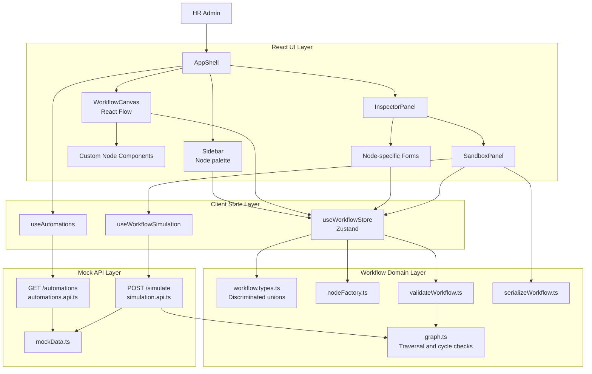
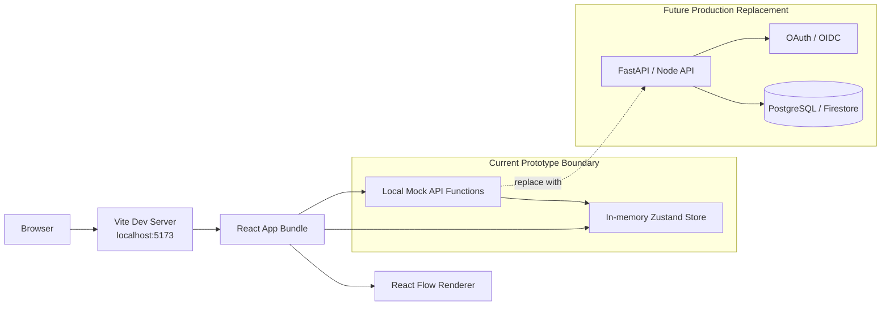

# Project Diagrams

## HR Workflow Diagram

This diagram shows the default workflow that ships with the prototype and the way the sandbox executes it.

## User Interaction Flow

## Application Architecture Diagram

## Deployment / Runtime Architecture

